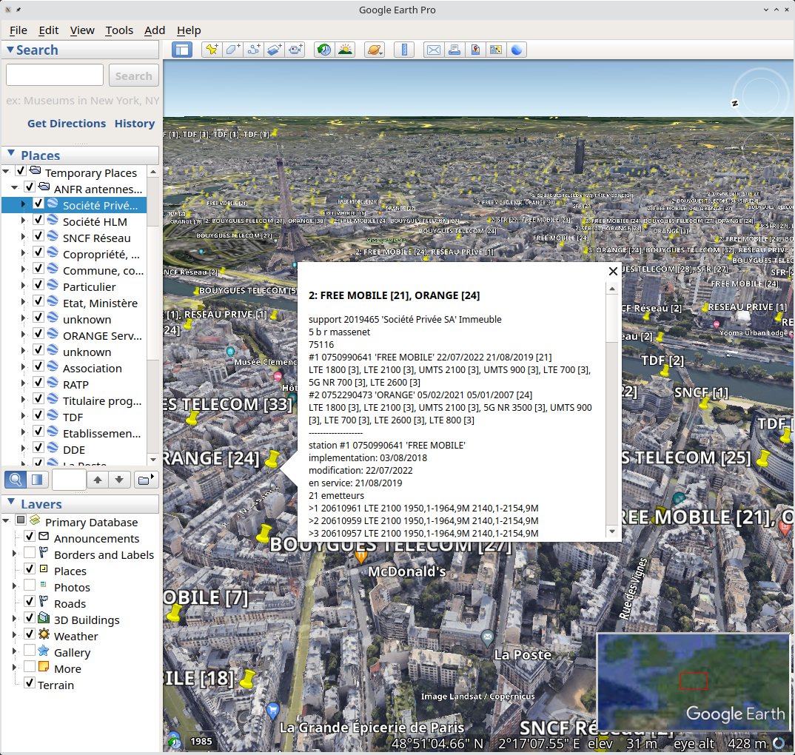

## antennes - Query and export KML files from ANFR radio sites data

features:
* generates KML files of emetteurs sites for all France and per-departement and per-proprietaire of the _support_
* each KML placemark for a _support_ contain informations about _stations_, _emetteurs_ and _antennes_ present on the site
* each KML placemark is colored in orange if it has been modified in the last 3 month and red if in the last month

You can download pre-generated KML files [here](https://ferme.ydns.eu/antennes/), with 2 files per month period:
* `anfr_YYYY-MM.kml` [~200MB] all-in-one KML file for the period with all _supports_
* `anfr_YYYY-MM_stats.txt` [~2KB] statistics for the period
Additionally in `split/` you can find for each period:
* `split/anfr_YYYY-MM_departement/anfr_YYYY-MM_departement_<dept-id>.kml` [<30MB] a KML file with _supports_ for a single _departement_
* `split/anfr_YYYY-MM_proprietaire/anfr_YYYY-MM_proprietaire_<prop-id>_<prop-name>.kml` [<10MB] a KML file with _supports_ owned by a single _proprietaire_
* `split/anfr_YYYY-MM_kml_split.zip` [~60MB] archive containing all split kml files

<br/>
_example usage: antennes KML file imported in Google Earth_

# Usage

```
usage: antennes [-Cv] [-k <dir>] <data_dir>
Query and export KML files from ANFR radio sites public data
-C       do not set any kml placemark colors
-k <dir> export kml files to this directory
-s       display antennes statistics
-v       verbose logging
if neither -s or -k are specified, this program only loads the data.
output kml files hierarchy:
   anfr.kml : all supports in a single file, one document section per proprietaire
   anfr_proprietaire/anfr_proprietaire_<proprietaire-id>_<proprietaire-name>.kml : one file per proprietaire
   anfr_departement/anfr_departement_<dept-id>.kml : one file per departement
kml placemark colors:
   orange for supports with stations updated in less than 3 months, red for 1 month, blue otherwise
```

# Build

`make` will build using clang

`make with_gcc` will build using gcc

`make debug` will build using clang and debug flags

# Example usage

Fetching latest data set

```
$ ./fetch_antennes.sh
downloading last 1 sets
[...]
[*] all sets downloaded to ./dl and extracted in ./extract
```

Generating KML files on data from 2022-08

```
$ ./antennes -k output_kml/ extract/2022-08
[+] loading files from extract/2022-08
35 natures of support
87271 supports
74 proprietaires
antennes: incoherent data set: line 72205: station 0422750464 already exists, ignoring
169115 stations in 108 departments and 2628 zones
176 exploitants
1953886 emetteurs and 71 systemes
3897941 bandes
antennes: incoherent data set: station 9720980043 not found for antenne 210680, ignoring
antennes: incoherent data set: station 9720980003 not found for antenne 1755967, ignoring
552795 antennes
82 types of antenne
[*] exporting kml to output_kml/
created 171 kml files
```

# Source code hierarchy

* `antennes.c` source code for this program
* `fetch_antennes.sh` fetch the data from data.gouv.fr
* `Makefile` targets to build and test this program
* `README.md` this file
* `release_antennes.sh` automate generation of KML and statistics for multiple sets of data

# Input data fields

```
SUP_ANTENNE.txt
    STA_NM_ANFR;AER_ID;TAE_ID;AER_NB_DIMENSION;AER_FG_RAYON;AER_NB_AZIMUT;AER_NB_ALT_BAS;SUP_ID
SUP_BANDE.txt
    STA_NM_ANFR;BAN_ID;EMR_ID;BAN_NB_F_DEB;BAN_NB_F_FIN;BAN_FG_UNITE
SUP_EMETTEUR.txt
    EMR_ID;EMR_LB_SYSTEME;STA_NM_ANFR;AER_ID;EMR_DT_SERVICE
SUP_EXPLOITANT.txt
    ADM_ID;ADM_LB_NOM
SUP_NATURE.txt
    NAT_ID;NAT_LB_NOM
SUP_PROPRIETAIRE.txt
    TPO_ID;TPO_LB
SUP_STATION.txt
    STA_NM_ANFR;ADM_ID;DEM_NM_COMSIS;DTE_IMPLANTATION;DTE_MODIF;DTE_EN_SERVICE
SUP_SUPPORT.txt
    SUP_ID;STA_NM_ANFR;NAT_ID;COR_NB_DG_LAT;COR_NB_MN_LAT;COR_NB_SC_LAT;COR_CD_NS_LAT;COR_NB_DG_LON;COR_NB_MN_LON;COR_NB_SC_LON;COR_CD_EW_LON;SUP_NM_HAUT;TPO_ID;ADR_LB_LIEU;ADR_LB_ADD1;ADR_LB_ADD2;ADR_LB_ADD3;ADR_NM_CP;COM_CD_INSEE
SUP_TYPE_ANTENNE.txt
    TAE_ID;TAE_LB
```

# Requirements

5GB of free RAM

# Ressources

## Data sources

Source des donnees sur data.gouv.fr
* https://www.data.gouv.fr/fr/datasets/donnees-sur-les-installations-radioelectriques-de-plus-de-5-watts-1/

Reutilisation des donnees
* Liste: https://www.data.gouv.fr/fr/datasets/donnees-sur-les-installations-radioelectriques-de-plus-de-5-watts-1/?reuses_page=1#community-reuses

Autres sources de donnees
* Mon Reseau Mobile: https://www.data.gouv.fr/fr/datasets/mon-reseau-mobile/
* ANFR: https://data.anfr.fr/anfr/visualisation/information/?id=dd11fac6-4531-4a27-9c8c-a3a9e4ec2107

## Similar projects

carte-fh
* https://carte-fh.lafibre.info/ (cliquer sur "Telecharger les fichier kml")

